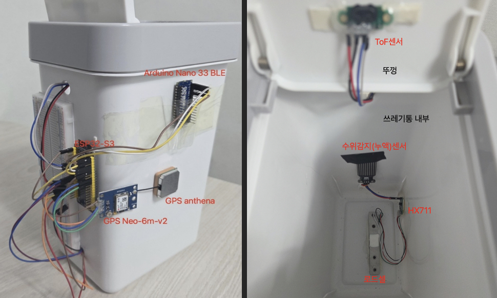
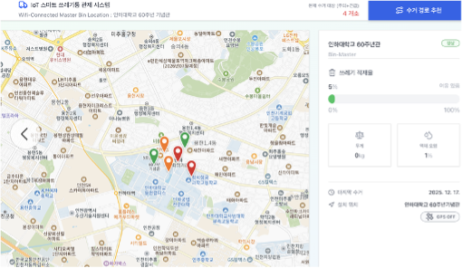
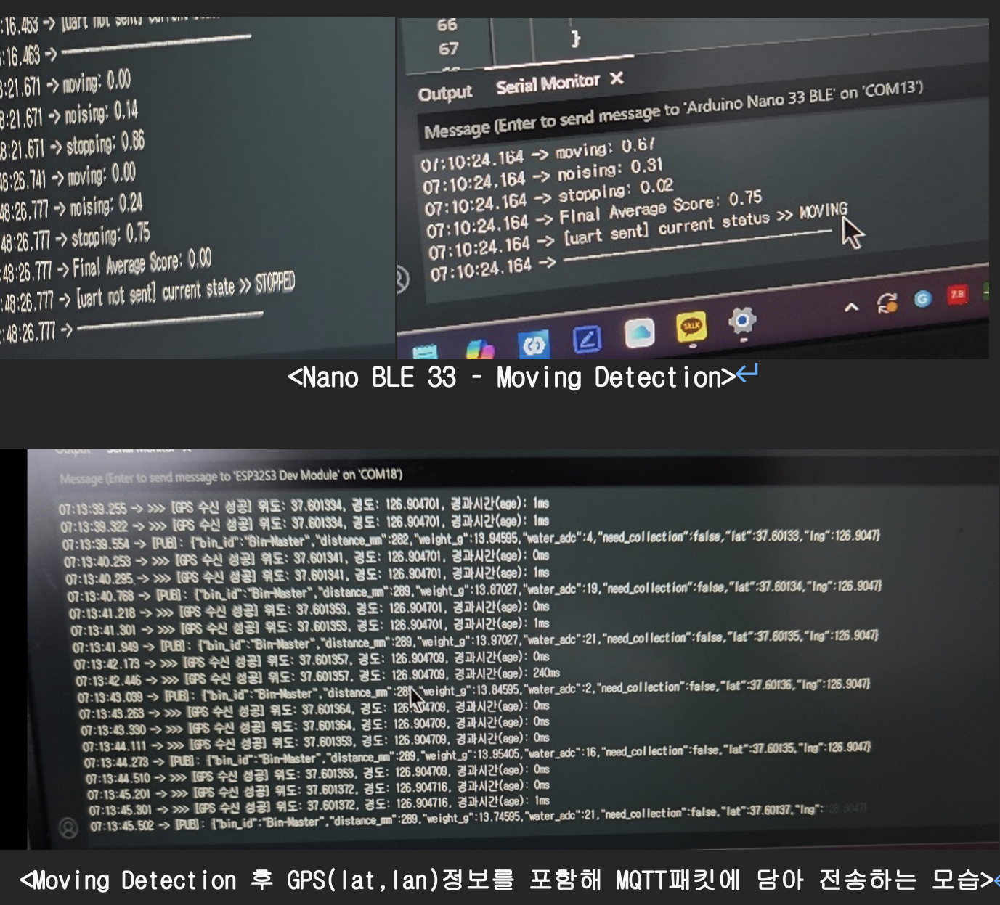

# IoT Smart Bin & Bins Control System


## 스크린샷





## 목차
- **dashboard-frontend**: 쓰레기통 모니터링을 위한 React + TypeScript + Vite UI
- **sensor-server**: PostgreSQL + MQTT 구독자를 포함한 Spring Boot 4 / Java 17 백엔드
- **hardware-esp32s3&nano**: ESP32-S3 & Nano 펌웨어, Edge Impulse 기반 모션 감지 / 통합 스케치 ino 파일


## 데이터 흐름 개요
1. **ESP32 펌웨어**(`hardware-esp32s3&nano/Master_bin` 또는 `Remote_bin`): MQTT로 JSON 발행 (토픽 `Bin/test/data`). 거리/무게/누수 값 포함. 필요 시 GPS 좌표 포함 및 모션 감지 시 GPS 활성화.
2. **sensor-server**: 해당 토픽 구독, `SensorReading` 레코드 저장 및 REST API 제공.
3. **dashboard-frontend**: REST API 호출, 대시보드/지도/리스트 화면 렌더링.

---

## 임베디드/펌웨어 (hardware-esp32s3&nano)

### MQTT 페이로드 예시
```json
{
  "bin_id": "Bin-Master",
  "distance_mm": 120,
  "weight_g": 180.5,
  "water_adc": 420,
  "need_collection": false,
  "lat": 37.45,
  "lng": 126.65
}
```
-	정지 시: 쓰레기통 상태(부피, 무게, 오염도)만 전송.
-	이동 감지 시: Arduino nano 33 ble 의 UART 트리거 (-> ESP32-S3 : main MCU)에 의해 GPS가 활성화되며, 유효한 위도(lat), 경도(lng) 좌표가 JSON 패킷에 동적으로 추가된다.



### 각 파일 역할 설명

실제 구현에서는 발표날까지 LoRa 자재 미배송 문제로 Master Bin과 Remote Bin은 둘 다 Wifi를 Telemetry로 활용하여 웹서버에 직접 데이터 전송하였다.

- **`Master_bin.ino`**: VL53L5CX ToF(8x8) + HX711 로드셀 + 아날로그 누수 센서 

  1초마다 `Bin/test/data` 토픽으로 MQTT 발행. 거리/무게/누수 임계값으로 `need_collection` 판단. 초기 1회 기본 GPS 좌표(37.45, 126.65) 전송.

- **`Remote_bin.ino`**: Master Bin과 센서 데이터 송신 작업은 같다. 

  Nano 33 BLE Sense의 모션 추론 결과 “MOVING”/"STOPPING"을 UART로 수신하여 GPS제어(TinyGPS.h 라이브러리 사용)

- **`nano_motion_detect.ino`**: Arduino Nano 33 BLE Sense 내장 LSM9DS1 가속도계를 Edge Impulse 모델(`motion_detect_iot_bin_inferencing`)로 추론. 모션 스코어가 임계값(약 0.7) 이상일 경우 UART(Serial1)로 “MOVING”을 ESP32에 전송하여 GPS 게이팅.

- **`motion_detect_iot_bin_inferencing`**: 직접 제작한 Edge Impulse C++ 추론 라이브러리 

- **`EachSensor_testCode`**: 단일 센서 테스트용 스케치. `GPSNeo6m_code`, `HX711_code`, `LeakSensor_code`, `ToFSensor_code`로 구성. 개별 센서 검증용.


---

## 대시보드 프론트엔드 (dashboard-frontend)

- **구성**: React + TS + Vite
    - Kakao Maps JS SDK 로더: `src/lib/kakaoLoader.ts`
    - 센서 API 클라이언트: `src/lib/sensorApi.ts`
    - 샘플 쓰레기통 데이터: `src/lib/trashData.ts`

### 로컬 실행
```bash
cd dashboard-frontend
npm install
npm run dev -- --host
# 또는 npm run build 후 npm run preview
```

### 환경변수 설정 (.env에 복사)
```
VITE_API_BASE_URL=http://localhost:8080
VITE_KAKAO_MAP_KEY=<kakao_javascript_key>
```

- **동작 방식**: Dashboard/Map/List 탭으로 구성. Map 페이지는 카카오 지도를 로드하여 쓰레기통 마커 표시. 실시간 상태 확인을 위해 `/api/readings/latest?binId=...` 조회. API 데이터 부재 시 `trashBins` 데이터 대체 사용. 거리/무게/누수 값은 “채움 상태/수거 필요 상태”로 변환됨.

---

## 센서 서버 (sensor-server)

- **구성**: Spring Boot 4, Java 17, WebFlux/WebMVC, PostgreSQL용 JPA, Eclipse Paho 기반 MQTT.
    - 주요 클래스: `mqtt/MqttSubscriberConfig`(브로커 연결, 구독, SensorPayload 파싱, SensorReading 저장), `sensor/controller/SensorReadingController`(REST), `sensor/model/SensorReading`(JPA 엔티티).

### REST API
- `GET /api/readings?binId=<id>&limit=50`: 최신순 리스트 (binId 누락 시 400 응답)
- `GET /api/readings/latest?binId=<id>`: 최신 1건 (데이터 없으면 204 응답)
- 필드: `id`, `binId`, `distanceMm`, `weightG`, `waterAdc`, `needCollection`, `lat`, `lng`, `createdAt`.

### 설정 (application.properties)
기본값 존재, 환경변수로 덮어쓰기 가능.
- `SPRING_DATASOURCE_URL`
- `SPRING_DATASOURCE_USERNAME`
- `SPRING_DATASOURCE_PASSWORD`
- `APP_MQTT_BROKER_URL` (기본값: `tcp://165.246.44.72:2025`)
- `APP_MQTT_CLIENT_ID` (기본값: `sensor-server-backend`)
- `APP_MQTT_TOPIC` (기본값: `Bin/test/data`)
- `APP_MQTT_DEFAULT_BIN_ID` (bin_id 부재 시 대체값, 기본값: `Bin-Master`)
- `PORT` (기본값: `8080`)

### 실행 방법
- **로컬 실행**:
  ```bash
  cd sensor-server
  ./gradlew bootRun
  ```
- **JAR 빌드**:
  ```bash
  ./gradlew bootJar
  java -jar build/libs/*SNAPSHOT.jar
  ```
- **Docker**:
  ```bash
  docker build -t sensor-server .
  docker run -p 8080:8080 --env-file <env> sensor-server
  ```
